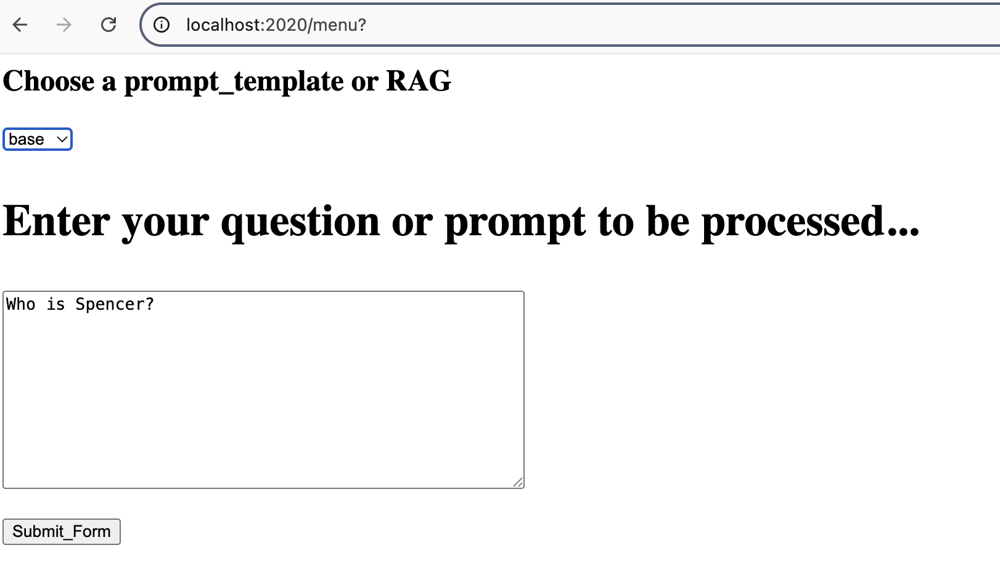
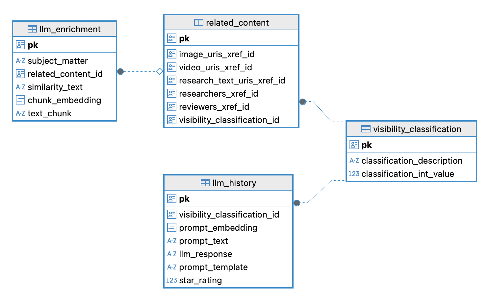

# roach-semantic-lookup & prompt customization

This example calls an LLM, stores the LLM response as text, along with both a vector embedding of the prompt and the text of the prompt used. The datastore used is CRDB. (Cockroach Database) 

The example showcases searching for a prompt using Vector Search in order to avoid repeated calls to the LLM.  The example also offers a simple way to adjust the prompt sent to the llm which showcases variety in LLM behavior ranging from a helpful FAQ to a SQL customizer, capable of populating preparedStatements with relevant arguments. 

This example also includes the option to utilize the Retrieval Augmented Generative AI or RAG pattern.  (you need to deliberately load some data using load_rag_data.py before this will work and then select the 'rag' option from the drop down of available templates)

See the following page for some sequence diagrams and some screenshots of the app behavior here: 


To run the example, which utilizes CRDB Vector Similarity Search Queries, you will need a connection to a Large Language Model (LLM) and a connection to CRDB version 25.3 or higher. 

## This project Uses https://localai.io/ and CockroachDB to demonstrate patterns commonly used with generative AI -specifically with a LLM.

## I choose to run localAI in podman on my laptop and I use these commands (once podman is installed)  You can of course run localAI in docker as well if you prefer:

```
podman machine start
podman run -ti --name local-ai -p 6060:8080 localai/localai:latest
```

Once the localAI container is running connect to it in a browser at (http://localhost:6060/browse/) and load the model you wish to use.  The hard-coded one for this example is tinyswallow-1.5b-instruct , so enter that into the search bar and load it into your instance to continue running this program 'as is'. 

## install and Initialize a cockroach database to act as a vectorDB:

** download cockroachdb binary (you can use a single instance for testing) 

for mac you do:
```
brew install cockroachdb/tap/cockroach
```

You can then check for location/existence of cockroachDB:
```
which cockroach
```

<em> See full instructions here:  https://www.cockroachlabs.com/docs/v25.2/install-cockroachdb-mac.html 

(There are options there for Linux and Windows as well)
</em>

## You can start a single node instance of cockroachDB in the following way:

to keep things as simple as possible, start an instance requiring no TLS (Transport Layer Security):

```
cockroach start-single-node --insecure --accept-sql-without-tls --background
```

<em>See full instructions here:  https://www.cockroachlabs.com/docs/stable/cockroach-start-single-node  </em>

By default:

This local instance of cockroachDB will run listening on port 26257 (for SQL and commandline connections)

This local instance will also listen on port 8080 with its web-browser-serving dbconsole UI 

## From a separate shell you can connect to this instance, create a database and the tables needed to begin:

to execute all the SQL commands needed plus some test queries from the root of this project do:
```
cockroach sql --insecure -f crdb_setup.sql
```

## thoughts on calculating vector distances in CRDB: For Semantic Search against text embeddings you have the choice to use the function: cosine_distance(vec1,vec2)  
```
-- filter on percentage match option: 
-- cosine_distance(vec1,vec2)
```

## You can also choose to use the following syntax when using Vector indexes:

```
<=>
```

Where the result is a number revealing how close to zero difference exists between the stored vectors in the interesting table and the vectorized incoming prompt:

```
existing_prompt_embedding <=> incoming_prompt_embedding
```


### See this documentation on our vector indexing support:
https://www.cockroachlabs.com/docs/v25.4/vector-indexes.html 

## For retrieving cached responses we can target 65% similar prompts (test your own data and embeddings etc for the threshold that works for you) The essential query we will use to check for a semantic match to an incoming prompt will be:

```
WITH target_vector AS (
        SELECT '{incoming_prompt_vector}'::vector AS ipv
    )
    SELECT
    llm_response,
    star_rating,
    ROUND(
        GREATEST(0, LEAST(1, 1 - (prompt_embedding <=> ipv))) * 100,
        2
    ) AS "Percent Match"
    FROM llm_history, target_vector
    WHERE star_rating >= %s
    AND prompt_template = %s
    AND GREATEST(0, LEAST(1, 1 - (prompt_embedding <=> ipv))) * 100 > 65
    ORDER BY "Percent Match" DESC
    LIMIT 2;
```

## If you wish to execute other sql -- The following command connects using the provided SQL CLI:

```
cockroach sql --insecure
```

## Switch to the database of interest:

```
use vdb;
```

## A sample query you may want to try after some prompts and responses have been collected.

```
select prompt_text,star_rating,prompt_template from llm_history order by star_rating asc;
```

## Or, perhaps you would like to curate and modify a generated response.

### Assuming someone prompted the program with this text: 'what is toothpaste good for?'

### We can change the cached response to be more to our liking:

```
UPDATE llm_history SET llm_response='Toothpaste helps clean teeth and polish silver jewellry.' where prompt_text='what is toothpaste good for?';
```

# where data visibility is a concern, you can adjust the subject_matter to make the enrichment data visible or adjust the subject_matter to hide the data

### Example: after loading the rag enrichment data, one of the entries is hidden.  

```
update llm_enrichment set subject_matter='public' where subject_matter='internal_general';
```

### The following rag query should now produce informed results:

* how do I ensure a cut-free image when using the 6xx XR Security X-ray System?


## Python-preparation Steps for running the project on your dev machine:


1. Create a virtual environment:

```
python3 -m venv roachsc
```

2. Activate it:  [This step is repeated anytime you want this venv back]

```
source roachsc/bin/activate
```

On windows you would do:

```
roachsc\Scripts\activate
```

If no permission in Windows
 The Fix (Temporary, Safe, Local):
In PowerShell as Administrator, run:

```
Set-ExecutionPolicy -Scope CurrentUser -ExecutionPolicy RemoteSigned
```

Then confirm with Y when prompted.


3. Python will utilize this requirements.txt in the project:

```
psycopg[binary]>=3.0
etc ...
```

4. Install the libraries: [should only be necesary to do this one time per environment, but I found I needed to execute 2x to get psycopg installed]

```
pip3 install -r requirements.txt
```

>[!IMPORTANT] 
... 

5. SEVERAL THINGS ARE HARD CODED IN THIS EXAMPLE! (for example the use of localhost for both crdb and localAI connections)

Edit your local copy of the code in connection_stuff.py as you prefer/need for the connection settings.  

If you are using a secure database, you can edit the contents of the db_config_secure dictionary to map to your repository for your certificates.  You will also need to set the env variable SECURE_CRDB=true  

```
export SECURE_CRDB=true
``` 

## if running the sql client that comes with CRDB in secure mode you would need to be certain to have the necessary certificates stored in a reachable folder and include them in your startup command for the client like this:

```
cockroach sql --certs-dir=/Users/owentaylor/.cockroach-certs --host=localhost --port=26257
```

# A simple web interface is available for use and is started using:

```
python3 bottlewebinterface.py
```

## try it out by going to http://localhost:2020/menu 

## the web interface allows you to choose a prompt template or rag wrapper (see below for setup) for the LLM and offers the choice to save the generated responses in the database for rapid reuse

>[!NOTE] 
> The UI looks like this:



# play with different prompt templates by selecting them in the first field then watch for the different responses generated

Try asking:  "Tell me about hotdogs"  using the base template

If you save the result, you can then try again using the same template and this query: "Why would I want to eat a hotdog?"  The two prompts about hotdogs are similar enough that you should see the cached response from the first prompt be returned as a response to the second prompt.  Note the speed of retrieval and time spent interacting with the DB and the LLM. 

## You can also select RAG (Retrieval Augmented Generative AI) as an option 

### (this behaves in a more dynamic but similar fashion to the basic prompt engineering caused by selecting poet or gang or music, etc) to make this possible you must first load searchable embeddings and text into the database. <em>This can be accomplished using the command line program 'load_rag_data.py' </em> 

```
python3 load_rag_data.py
```

### With the above command issued, the data in the ragdata.json file will be loaded into the database and will allow for some simple RAG examples to work

### when you restart the program, the database will have some specific information stored that will provide details for related prompts 

<b><em>The db schema hints at the need to provide guardrails and pointers to externally stored information, to keep it simple, this example project does not include such external resources and all included data is classified as publicly available</em></b>



# note that the rag option will specifically allow for retrieving context and information dynamically (You can edit the ragdata.json file to add additional data)

>[!NOTE] 
> If you haven't already: try asking:  " who is Spencer? "  using the rag drop down option 
> Then deliberately Save the response by clicking the radio button labelled True and giving the response a rating of 3 or higher stars  (hopefully, the response from the LLM is useful enough to warrant caching)
<hr>

* You could then again choose the rag drop down and provide a prompt like:  

```
tell me about Spencer
```

Which will be similar enough to result in the cached response being returned.

* or you could test different rag-enriched subjects with prompts like the following when choosing the rag drop down option:

```
What database did Shipt use before they switched to cockroachDB?
```

or:

```
Which company provides a fruit in Florida that is high in Vitamin C?
```

or:

```
Who created Gimp?
```

## if the augmentation data is loaded, you should get a rich reply that hones in on the provided data

<hr/><p /><hr/>

## You can try your hand at more prompt engineering by playing with the alternate templates provided in the file: prompt_templates.py: ( the user input can be couched in such a template to modify the output of the LLM )

Look at the code in prompt_templates.py:

```
TEMPLATE_MAP = {
    "base": template_base,
    "music": template_music,
    "gang": template_gang,
    "poet": template_poet,
    "rag": template_rag,
    "sql": template_sql_tool
}
```

# another use case that is becoming popular is the use of agentic AI where an LLM generates code dynamically (sometimes executing it as well)

## Let's consider an example of how an LLM might become part of a tool-use chain and fill in necessary blanks to dynamically interact with DB etc:

```
+-----+----------+----------+--------+----------+
ID    | name     | species  | locale |    bd    |
+-----+----------+----------+--------+----------+
as16e | Gloria   | gorilla  | india  | 19971106 |
kj87g | Max      | tiger    | nepal  | 20100102 |
sv278 | Bubbles  | elephant | kenya  | 20180617 |
+-----+----------+----------+--------+----------+ 
```

Imagine a table containing all the animals in a zoo with their names, species, original locale, age etc.

Q: How can we dynamically query such a table based on a user's natural language question like this one:

### "I remember an older gorilla - maybe 25 or so years old and he came from India. What was his name?"

You can solve for this by manipulating the prompt sent to an LLM so that it dynamically generates a SQL query capable of retrieving the answer from a traditional database.  (some function then, would execute the generated SQL query and either pass the results to the LLM for inclusion in a friendly response, or pass the results directly back to the calling program)

We can limit the chance of costly queries if we construct a PreparedStatement and only ask the LLM to fill in the variables:

```
SELECT name, (EXTRACT(YEAR FROM AGE(current_date, bd))) as AGE FROM zoo.animals WHERE le = %S AND ss = %s LIMIT 1; 
```

* To demonstrate how an LLM might be able to parse natural language and assign variables as needed:

Select the sql prompt template and ask the program the following: 
(this assumes that there is only one logical path forward [hard-coded prompt includes the PreparedStatement] or you can look up the PreparedStatement effectively based on the context from the user prompt and the overarching purpose of the bot session in question)

```
"I remember an older gorilla - maybe 25 or so years old and he came from India. What was his name?"
```

## While the prepared statement is currently hard-coded in the prompt template, you should be able to understand how the full prompt could be dynamically constructed at runtime using a combination of RAG and possibly some routing/filtering based on environment or user-specific data


6. When you are done using this environment you can deactivate it:

```
deactivate
```
