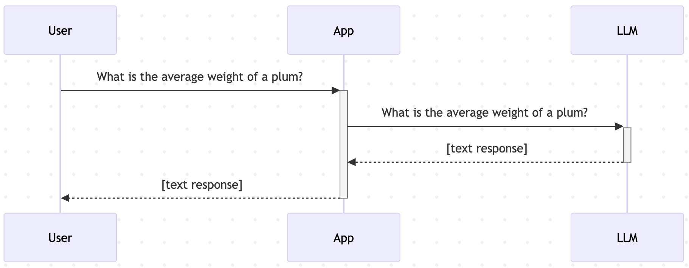
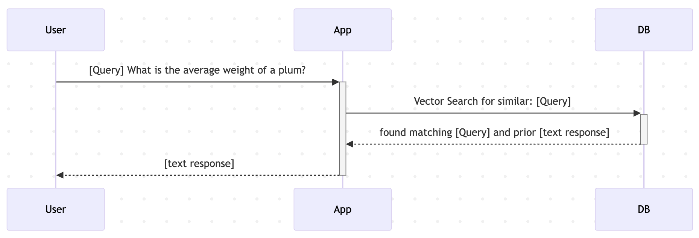
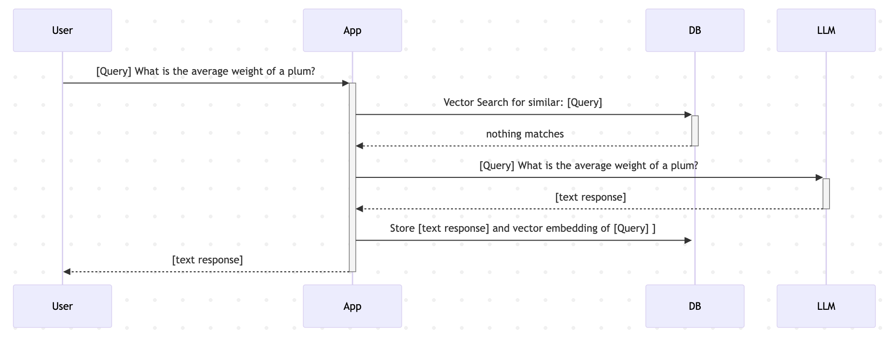
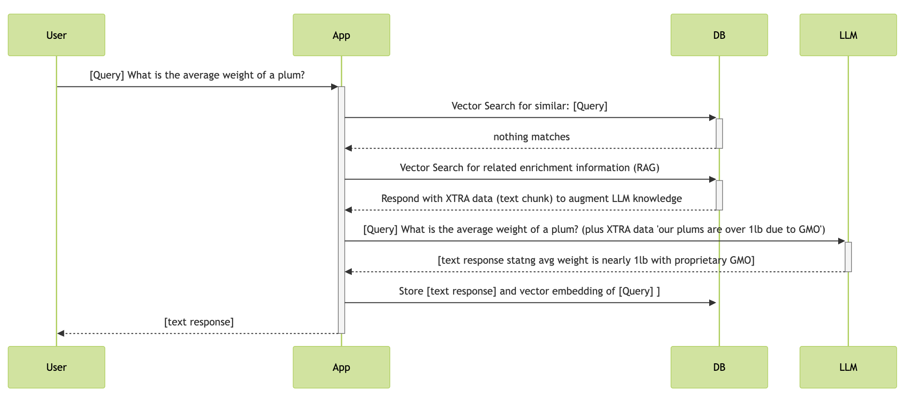

# roach-semantic-lookup & prompt customization
This example calls an LLM, stores the LLM response as text, along with both a vector embedding of the prompt and the text of the prompt used. The datastore used is CRDB.  The example showcases searching for a prompt using Vector Search in order to avoid repeated calls to the LLM.  The example also offers a simple way to adjust the prompt sent to the llm which showcases variety in LLM behavior ranging from a helpful FAQ to a SQL customizer, capable of populating preparedStatements with relevant arguments. 

## This example starts with a pattern known as semantic caching.

## It also highlights the impact of prompt engineering and encourages you to adjust the prompt template used as well as experiment with RAG (Retrieval Augmented Generative AI). (Scan this document for the full set of startup options)


non-cached workflow when interacting with an LLM:

```
A: (UserPrompt as text is generated/accepted by system) 
B: Call LLM API with UserPrompt as text
C: (LLMResponse as Text is returned to user)
```


Semantic caching workflow Successful match:

```
start workflow
A: (UserPrompt as text is generated/accepted by system) 
B: (UserPrompt as embedding is generated) 
C: CRDB Vector Similarity Query issued to check for existing responses to same semantic prompt 
If 
   Match to an existing stored UserPrompt Embedding exists : 
   D: Fetch Associated Stored LLM Text response and return to user
end workflow
```



Semantic caching workflow No match:

```
start workflow
A: (UserPrompt as text is generated/accepted by system) 
B: (UserPrompt as embedding is generated) 
C: CRDB Vector Similarity Query issued to check for existing responses to same semantic prompt 
If 
    No Match to an existing stored UserPrompt Embedding exists : 
    D: Call LLM API with UserPrompt as text 
    E:  Store UserPrompt Embedding along with userPrompt as text and LLMResponse as Text in CRDB
    F:  Return LLM Text response to user
end workflow
```



## This example Uses https://localai.io/ and CockroachDB to demonstrate basic Semantic Caching of responses to user prompts made to an LLM.

Again: This project is an example of using CRDB Vector Similarity Search/Queries with Python

To run the example, which utilizes CRDB Vector Similarity Search Queries, you will need a connection to a Large Language Model (LLM) and a connection to CRDB version 25.2.1 or higher. 

## install and Initialize a cockroach database to act as a vectorDB:


** download cockroachdb binary (you can use a single instance for testing) 

for mac you do:
```
brew install cockroachdb/tap/cockroach
```

You can then check for location/existence of cockroachDB:
```
which cockroach
```

<em> See full instructions here:  https://www.cockroachlabs.com/docs/v25.2/install-cockroachdb-mac.html 

(There are options there for Linux and Windows as well)
</em>

## You can start a single node instance of cockroachDB in the following way:

to keep things as simple as possible, start an instance requiring no TLS (Transport Layer Security):

```
cockroach start-single-node --insecure --accept-sql-without-tls --background
```

<em>See full instructions here:  https://www.cockroachlabs.com/docs/stable/cockroach-start-single-node  </em>

By default:

This local instance of cockroachDB will run listening on port 26257 (for SQL and commandline connections)

This local instance will also listen on port 8080 with its web-browser-serving dbconsole UI 

## From a separate shell you can connect to this instance, create a database and the tables needed to begin:

to execute all the SQL commands needed plus some test queries from the root of this project do:
```
cockroach sql --insecure -f crdb_setup.sql
```

## thoughts on calculating vector distances in CRDB: For Semantic Search against text embeddings we use the function: cosine_distance(vec1,vec2)
```
-- filter on percentage match option: 
-- cosine_distance(vec1,vec2)
```

## the essential query we will use to check for a semantic match to an incoming prompt will be:

```
WITH target_vector AS (
        SELECT '{incoming_prompt_vector}'::vector AS ipv
    )
    SELECT
    llm_response,
    star_rating,
    ROUND(
        GREATEST(0, LEAST(1, 1 - cosine_distance(prompt_embedding, ipv))) * 100,
        2
    ) AS "Percent Match"
    FROM llm_history, target_vector
    WHERE star_rating >= %s
    AND ROUND(
        GREATEST(0, LEAST(1, 1 - cosine_distance(prompt_embedding, ipv))) * 100,
        2
    ) > 82
    ORDER BY "Percent Match" DESC
    LIMIT 2;
```

If you wish to execute other sql -- The following command connects using the provided SQL CLI:

```
cockroach sql --insecure
```

Switch to the database of interest:

```
use vdb;
```

A sample query you may want to try after some prompts and responses have been collected.

```
select prompt_text,star_rating from llm_history order by star_rating asc;
```

Or, perhaps you would like to curate and modify a generated response.

Assuming someone prompted the program with this text: 'what is toothpaste good for?'

We can change the cached response to be more to our liking:

```
UPDATE llm_history SET llm_response='Toothpaste helps clean teeth and polish silver jewellry.' where prompt_text='what is toothpaste good for?';
```
## Python-preparation Steps for running the samples on your dev machine:


1. Create a virtual environment:

```
python3 -m venv roachsc
```

2. Activate it:  [This step is repeated anytime you want this venv back]

```
source roachsc/bin/activate
```

On windows you would do:

```
roachsc\Scripts\activate
```

If no permission in Windows
 The Fix (Temporary, Safe, Local):
In PowerShell as Administrator, run:

```
Set-ExecutionPolicy -Scope CurrentUser -ExecutionPolicy RemoteSigned
```

Then confirm with Y when prompted.


3. Python will utilize this requirements.txt in the project:

```
psycopg[binary]>=3.0
etc ...
```

4. Install the libraries: [should only be necesary to do this one time per environment, but I found I needed to execute 2x to get psycopg installed]

```
pip3 install -r requirements.txt
```

5. SEVERAL THINGS ARE HARD CODED IN THIS EXAMPLE! (for example the use of localhost for both crdb and localAI connections)

Edit your local copy of the code in project_utils.py as you prefer/need for the connection settings.  


To use the default star_rating filter of 3 or better stars just call the program:

```
python3 simpleLLM_with_cache.py 
```

* The example will call an LLM and display the response, as well as display the prompt sent to the LLM 

* The program will use semantic caching and the incoming prompts will be stored in CRDB in their embedded form so that Vector Search can find them - Note however that all queries filter according to the star_rating of the responses

* NB: If a stored response to a query does not have a star_rating high enough to pass the star_rating filter, a new prompt and response will be stored alongside the old one (currently, all responses are given a star_rating of 3 as a default when they are initially stored)

* Prompt engineering options: (note if you fetch a CRDB stored result, the LLM never gets called, and the prompt engineering has no effect)
You may wish to force-fail the matching query by demanding a higher star_rating.  
You can do this by calling the program with a higher number than is possible (the table has a constraint allowing only values between 1 and 5): 

```
python3 simpleLLM_with_cache.py 6 
```

* If you wish to disable the writing of new prompts and responses to the database you can add one more argument when starting up the program:

```
python3 simpleLLM_with_cache.py 6 nostore
```

# prompt engineering and context management:

## You may also adjust the prompts used in simpleLLM_with_cache.py and prompt_templates.py to adjust the behavior of the LLM 

The existing logic insists on the ordering of args to the program and when you specify a prompt to modify the flavour of the LLM response, that response will not be persisted to the database.  (fork the project and change it if you wish other behavior) 

If you wish to specify a non-default prompt to the LLM, start the program; adding as an argument the keyname of the prompt template you wish to send to the LLM with each request like so:

```
python3 simpleLLM_with_cache.py 6 nostore poet
```

* You could then provide a prompt like:  

```
tell me about Spencer
```

and recieve a strange response!


## You can try your hand at more prompt engineering by playing with the alternate templates provided in the file: prompt_templates.py: ( the user input can be couched in such a template to modify the output of the LLM )

Look at the code in prompt_templates.py:

```
TEMPLATE_MAP = {
    "base": template_base,
    "cockroach": template_cockroach,
    "music": template_music,
    "gang": template_gang,
    "poet": template_poet,
    "rag": template_rag,
    "sql": template_sql_tool
}
```

# A simple example of RAG Retrieval Augmented Generative AI is available too.

### (this behaves in a more dynamic but similar fashion to the basic prompt engineering caused by selecting poet or gang or music, etc) to make this possible you must first load searchable embeddings and text into the database. This can be accomplished after starting the program and issuing the command 'load' at the prompt.  The data in the ragdata.json file will be loaded into the database and will allow for some simple RAG examples 
### when you restart the program, the database will have some specific information stored that will provide details for related prompts 
## to test, start the program with the 'rag' argument:

```
python3 simpleLLM_with_cache.py 6 nostore rag
```

* You could then provide a prompt like:  

```
tell me about Spencer
```

* or:

```
what database did shipt use before they switched to cockroachDB?
```

## if the augmentation data is loaded, you should get a rich reply that hones in on the provided data


# another use case that is becoming popular is the use of agentic AI where an LLM generates code dynamically (sometimes executing it as well)
## Let's consider an example of how an LLM might become part of a tool-use chain and fill in necessary blanks to dynamically interact with DB etc:

```
+-----+----------+----------+--------+----------+
ID    | name     | species  | locale |    bd    |
+-----+----------+----------+--------+----------+
as16e | Gloria   | gorilla  | india  | 19971106 |
kj87g | Max      | tiger    | nepal  | 20100102 |
sv278 | Bubbles  | elephant | kenya  | 20180617 |
+-----+----------+----------+--------+----------+ 
```

Imagine a table containing all the animals in a zoo with their names, species, original locale, age etc.

Q: How can we dynamically query such a table based on a user's natural language question like this one:

### "I remember an older gorilla - maybe 25 or so years old and he came from India. What was his name?"

You can solve for this by manipulating the prompt sent to an LLM so that it dynamically generates a SQL query capable of retrieving the answer from a traditional database.  (some function then, would execute the generated SQL query and either pass the results to the LLM for inclusion in a friendly response, or pass the results directly back to the calling program)

We can limit the chance of costly queries if we construct a PreparedStatement and only ask the LLM to fill in the variables:

```
SELECT NICKNAME, (EXTRACT(YEAR FROM AGE(current_date, bd))) as AGE FROM zoo.animals WHERE le = %S AND ss = %s LIMIT 1; 
```

* To demonstrate how an LLM might be able to parse natural language and assign variables as needed:

First - start the program using the sql prompt template:

```
python3 simpleLLM_with_cache.py 6 nostore sql
```

Next - ask the program the following: (this assumes that there is only one logical path forward or you can look up the PreparedStatement effectively based on the context from the user prompt and the overarching purpose of the bot session in question)

```
"I remember an older gorilla - maybe 25 or so years old and he came from India. What was his name?"
```

## Whil the prepared statement is currently hard-coded in the prompt template, you should be able to understand how the full prompt could be dynamically constructed at runtime using a combination of RAG and prompt engineering and possibly some routing/filtering based on environment or user-specific data


6. When you are done using this environment you can deactivate it:

```
deactivate
```


