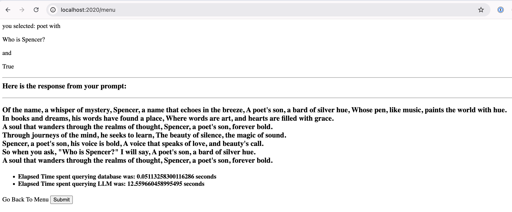
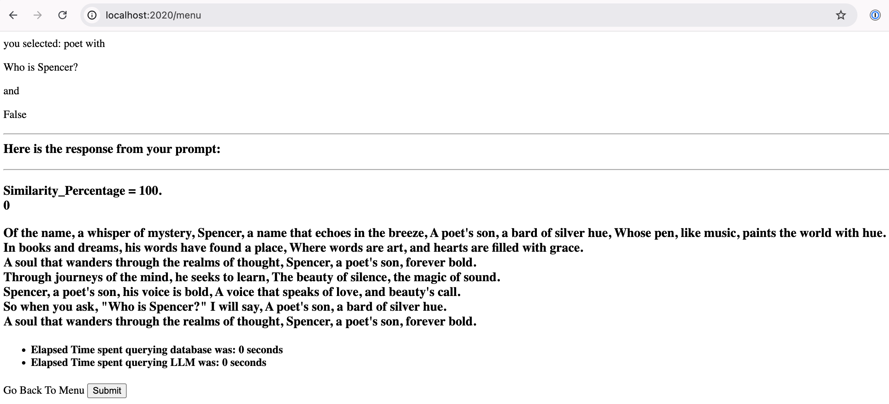
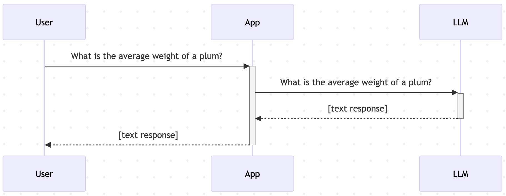
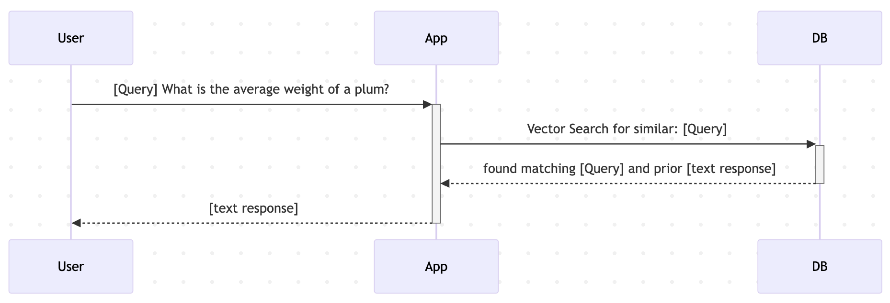
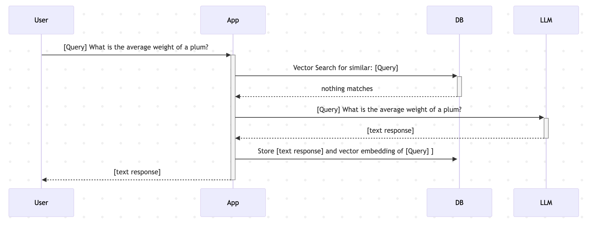
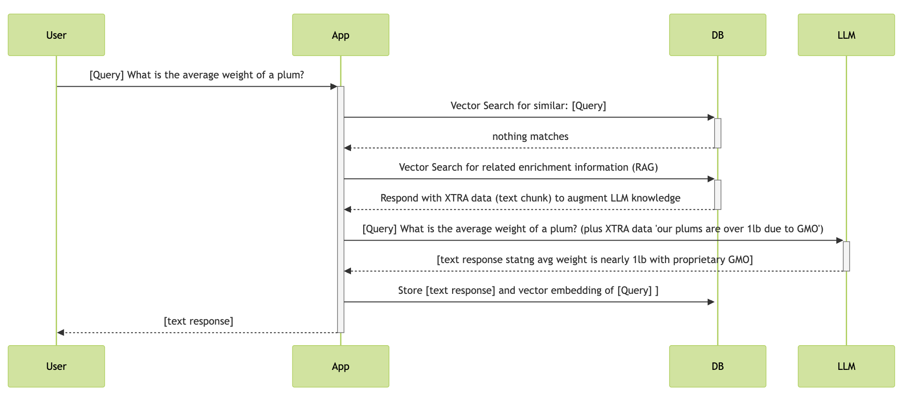
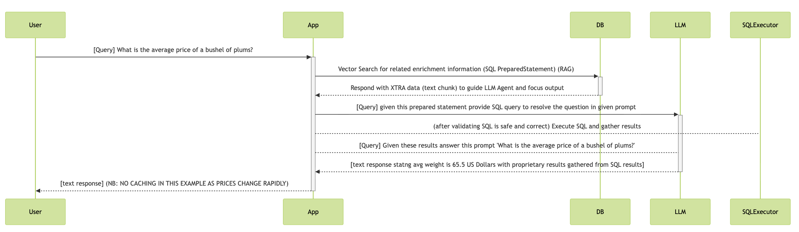

This example showcases a pattern known as semantic caching. LOOK AT THE elapsed TIME DIFFERENCE (all services are running on the same laptop)


>[!NOTE] 
> * Example LLM use with no cache:





>[!NOTE] 
> * Example LLM use with cache enabled (semantic match for similar query):





It also highlights the impact of prompt engineering and encourages you to adjust the prompt template used as well as experiment with RAG (Retrieval Augmented Generative AI). (Scan this document for the full set of startup options)


>[!NOTE] 
> non-cached workflow when interacting with an LLM:


```
A: (UserPrompt as text is generated/accepted by system) 
B: Call LLM API with UserPrompt as text
C: (LLMResponse as Text is returned to user)
```




>[!NOTE] 
> Semantic caching workflow Successful match:


```
start workflow
A: (UserPrompt as text is generated/accepted by system) 
B: (UserPrompt as embedding is generated) 
C: CRDB Vector Similarity Query issued to check for existing responses to same semantic prompt 
If 
   Match to an existing stored UserPrompt Embedding exists : 
   D: Fetch Associated Stored LLM Text response and return to user
end workflow
```




>[!NOTE] 
> Semantic caching workflow No match:


```
start workflow
A: (UserPrompt as text is generated/accepted by system) 
B: (UserPrompt as embedding is generated) 
C: CRDB Vector Similarity Query issued to check for existing responses to same semantic prompt 
If 
    No Match to an existing stored UserPrompt Embedding exists : 
    D: Call LLM API with UserPrompt as text 
    E:  Store UserPrompt Embedding along with userPrompt as text and LLMResponse as Text in CRDB
    F:  Return LLM Text response to user
end workflow
```




A simple example of RAG Retrieval Augmented Generative AI is also part of this project




The 'sql' template points us towards another use case that is becoming popular: the use of agentic AI where an LLM generates code dynamically (sometimes executing it as well). <em>NB: As of 2025-08-08 the SQL is generated and revealed as a response, but not executed.</em>



Let's consider an example of how an LLM might become part of a tool-use chain and fill in necessary blanks to dynamically interact with DB etc:

```
+-----+----------+----------+--------+----------+
ID    | name     | species  | locale |    bd    |
+-----+----------+----------+--------+----------+
as16e | Gloria   | gorilla  | india  | 19971106 |
kj87g | Max      | tiger    | nepal  | 20100102 |
sv278 | Bubbles  | elephant | kenya  | 20180617 |
+-----+----------+----------+--------+----------+ 
```

Imagine a table containing all the animals in a zoo with their names, species, original locale, age etc.

With the correct template and additional workflow, we can dynamically query such a table based on a user's natural language question like this one:

"I remember an older gorilla - maybe 25 or so years old and he came from India. What was his name?"

You can solve for this by manipulating the prompt sent to an LLM so that it dynamically generates a SQL query capable of retrieving the answer from a traditional database.  (some function then, would execute the generated SQL query and either pass the results to the LLM for inclusion in a friendly response, or pass the results directly back to the calling program)

